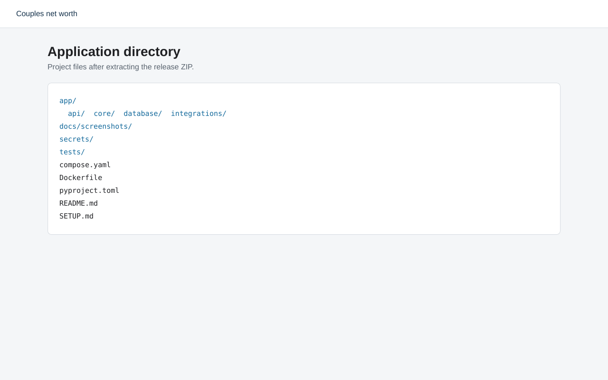
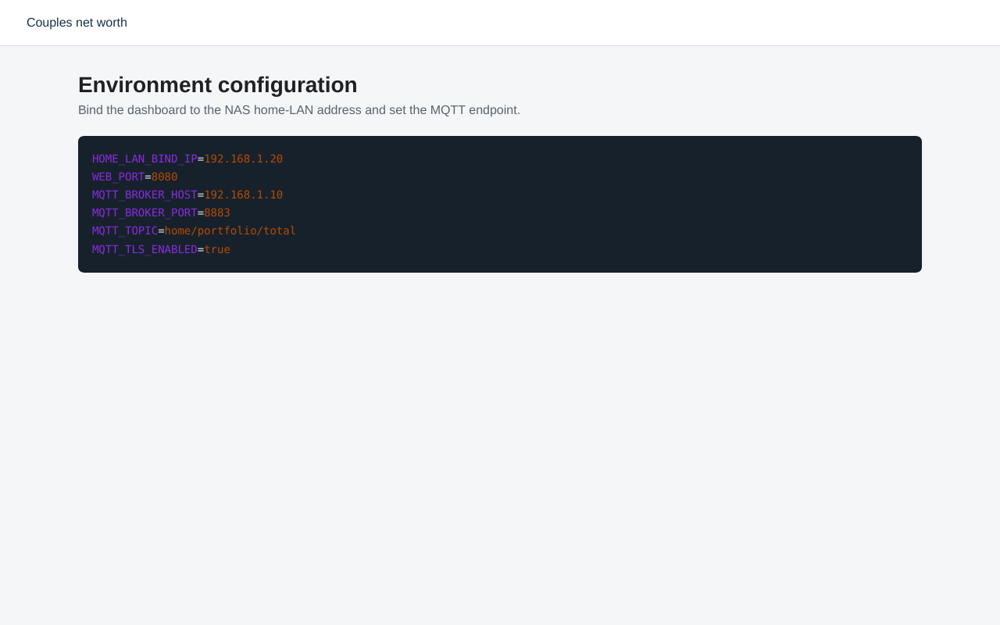
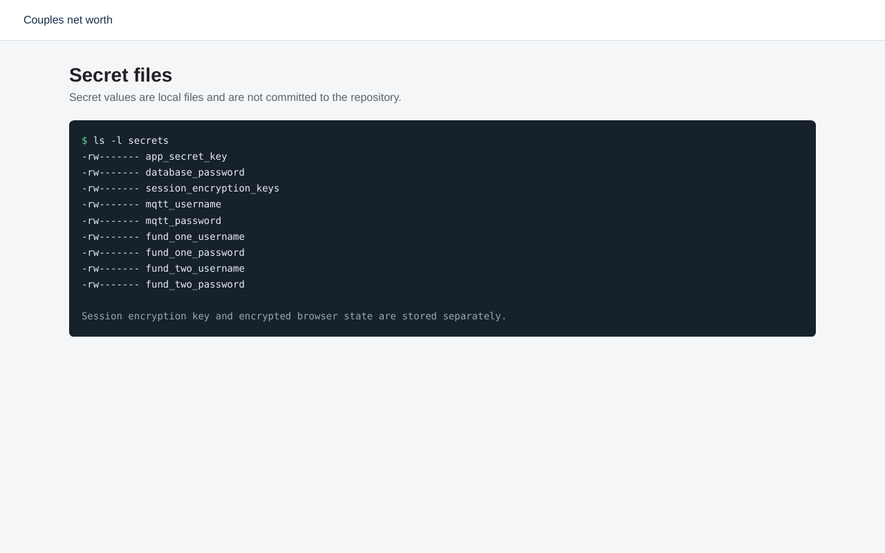
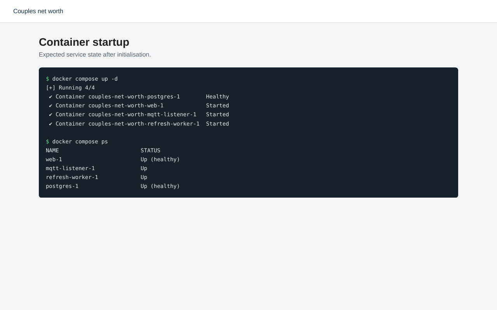
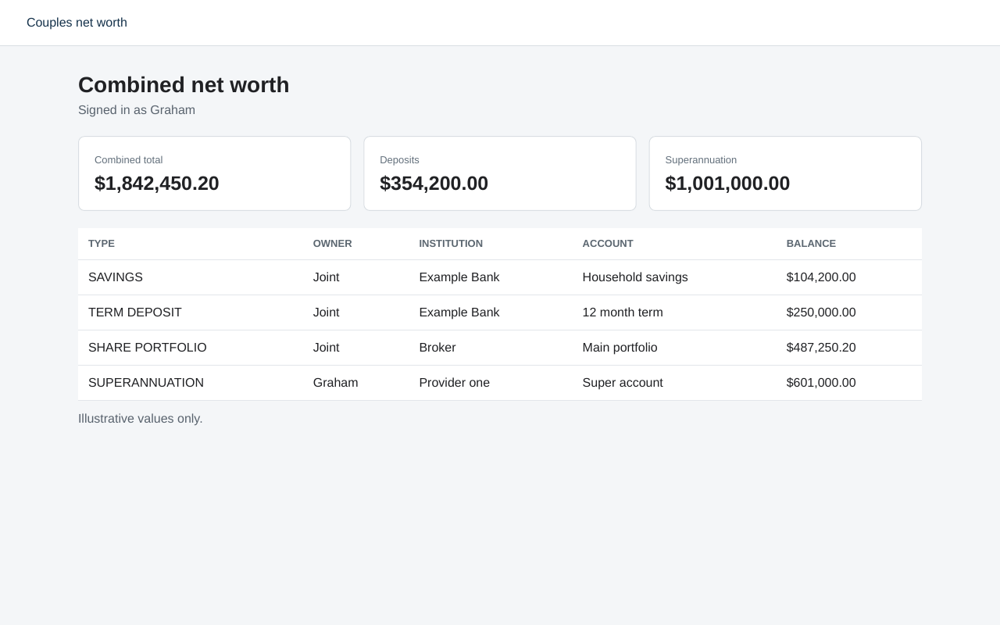
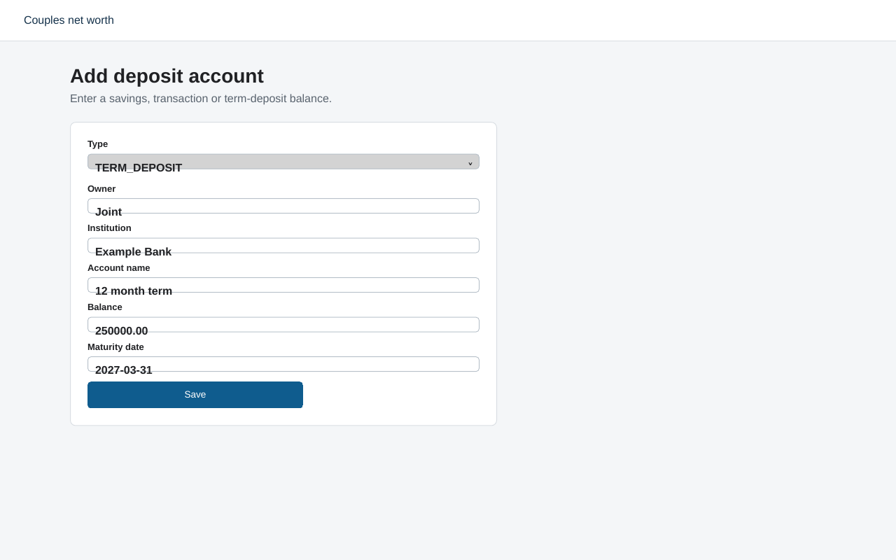

# Setup guide

This guide installs the application on a home-network Docker host such as a
Synology NAS managed through Dockhand. The examples use `192.168.1.20` for the
NAS and `192.168.1.10` for the MQTT broker. Replace them with addresses from
your network.

## 1. Extract the application

Extract the ZIP into a private directory on the NAS, for example:

```sh
mkdir -p /volume1/docker/couples-net-worth
cd /volume1/docker/couples-net-worth
unzip couples-net-worth.zip
cd couples-net-worth
```

The resulting directory should contain `compose.yaml`, `Dockerfile`,
`pyproject.toml`, `app`, `tests`, `secrets` and `SETUP.md`.



## 2. Configure the home-network and MQTT settings

Copy the example environment file:

```sh
cp .env.example .env
chmod 600 .env
```

Edit `.env`:

```dotenv
HOME_LAN_BIND_IP=192.168.1.20
WEB_PORT=8080
MQTT_BROKER_HOST=192.168.1.10
MQTT_BROKER_PORT=8883
MQTT_TOPIC=home/portfolio/total
MQTT_TLS_ENABLED=true
```

`HOME_LAN_BIND_IP` must be the NAS address on the home LAN, not `0.0.0.0`.
Do not create a router port-forward, public reverse-proxy route or tunnel for
this application. Also use the Synology firewall to allow TCP 8080 only from
the home subnet.



## 3. Create the secret files

Run the following from the application directory:

```sh
mkdir -p secrets
openssl rand -hex 32 > secrets/app_secret_key
openssl rand -base64 36 > secrets/database_password
python3 -c 'from cryptography.fernet import Fernet; print(Fernet.generate_key().decode())' \
  > secrets/session_encryption_keys
```

Create the remaining files using an editor that does not leave backup files:

```text
secrets/mqtt_username
secrets/mqtt_password
secrets/fund_one_username
secrets/fund_one_password
secrets/fund_two_username
secrets/fund_two_password
```

Then restrict access:

```sh
chmod 700 secrets
chmod 600 secrets/*
```

The Fernet key is mounted independently from the encrypted provider state. Do
not store the key in the provider-state Docker volume. Loss of the key makes the
saved session unreadable. Disclosure of the key allows the encrypted state to
be read and forged.



## 4. Build and initialise

```sh
docker compose build
docker compose run --rm web python -m app.cli init-db
docker compose run --rm web python -m app.cli create-user graham
docker compose run --rm web python -m app.cli create-user second-user
docker compose up -d
docker compose ps
```

Each user is prompted for a display name and a password of at least 12
characters. Passwords are stored as Argon2 hashes.



## 5. Open the dashboard

From a device on the home network, open:

```text
http://192.168.1.20:8080
```

Sign in with either local account. The combined dashboard counts joint assets
once and does not apportion them between the two people.



## 6. Add deposit accounts

Select **Add deposit account**. For term deposits, enter the maturity date.
Balances are stored as point-in-time valuations rather than overwriting prior
values.



## 7. Configure the share portfolio message

The MQTT listener expects one total portfolio value using the placeholder
schema below:

```json
{
  "schema_version": 1,
  "portfolio_id": "primary-share-portfolio",
  "currency": "AUD",
  "market_value": "487321.64",
  "valuation_time": "2026-09-28T06:00:00Z",
  "message_id": "1ea81937-63f7-46c6-b654-d51d35005c51"
}
```

Create one `SHARE_PORTFOLIO` account with `external_reference` set to
`primary-share-portfolio`. The placeholder UI does not yet expose that account
type, so create it using a migration, seed command or a small administration
extension before sending messages. Messages are deduplicated by `message_id`.

## 8. Complete each provider adapter

The two adapters remain provider-neutral until the actual fund names and login
pages are known:

```text
app/integrations/superannuation/provider_one.py
app/integrations/superannuation/provider_two.py
```

Each provider flow should:

1. Load encrypted Playwright storage state through `ProviderBrowserSession`.
2. Test whether the existing session is still authenticated.
3. If expired, enter the username and password from Docker secrets.
4. Stop and present `INTERACTION_REQUIRED` when MFA is requested.
5. Continue only after the account holder completes the real MFA challenge.
6. Read and validate the balance and its effective date.
7. Save Playwright storage state through `ProviderBrowserSession.save()`.
8. Clear encrypted state on explicit logout or repeated authentication failure.

The implementation must not bypass MFA, CAPTCHA or provider access controls.

## 9. Encrypted MFA-session storage

Playwright storage state can include cookies and local-storage tokens. This
application serialises that state in memory and writes only Fernet ciphertext
to `/app/data/provider-state/<provider>.state.enc`. File replacement is atomic,
and directory and file permissions are set to 700 and 600 respectively.

`session_encryption_keys` supports key rotation. Keys are newline separated,
with the newest key first. The newest key encrypts new state while older keys
allow existing state to be read until it has been rotated.

Verify that no plaintext cookies are visible:

```sh
docker compose exec refresh-worker sh -c \
  'ls -l /app/data/provider-state && grep -R "session" /app/data/provider-state || true'
```

A successful `grep` match should not reveal provider cookies or tokens.

## 10. Operations

View logs:

```sh
docker compose logs --tail=100 web
docker compose logs --tail=100 mqtt-listener
docker compose logs --tail=100 refresh-worker
```

Run quality checks:

```sh
docker compose run --rm web pytest
docker compose run --rm web ruff check .
docker compose run --rm web mypy app
```

Back up PostgreSQL separately. Treat database backups, the secret directory and
encrypted provider-state volume as sensitive material. Keep provider-state and
its encryption key in separate protected backup locations.

## 11. Updating

Before updating:

```sh
docker compose down
docker compose cp postgres:/var/lib/postgresql/data /secure/backup/location
```

Review dependency changes, rebuild, run tests and then restart:

```sh
docker compose build --pull
docker compose run --rm web pytest
docker compose up -d
```

For production use, replace `Base.metadata.create_all()` with reviewed Alembic
migrations before the first schema change.
